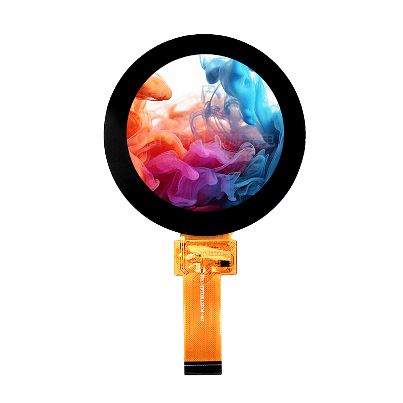

<p align="left"></p>

<h1 align="center">OSPTEK 2.1″ TFT 480×480 (ST77922 · MIPI)</h1>

<p align="center"><b>Round TFT / IPS module · MIPI · ST77922 · capacitive touch</b></p>

<p align="center"><a href="./README.md">简体中文</a> | English</p>

<p align="center">
  
  
  
  
</p>

<p align="center"></p>

## Contents

- [Overview](#overview)
- [Specifications](#specifications)
- [Sample projects](#sample-projects)
- [Repository layout](#repository-layout)
- [Resources](#resources)
- [Buy](#buy)
- [Support](#support)

---

## Overview

OSPTEK **2.1″ 480×480 TFT (IPS)** is a round **MIPI** color display module driven by **ST77922**, with capacitive touch (**ST7123**). Suited to wearables, round gauges, and compact circular HMI.

Spec ID (repository name): `2.1-tft-480x480-mipi-st77922`

Current module version: **YDP210LT001-V1**. Electrical and mechanical details follow [`docs/YDP210LT001-V1.pdf`](./docs/YDP210LT001-V1.pdf).

## Specifications

| Item | Spec |
| ---- | ---- |
| Size | 2.1 inch |
| Type | TFT / IPS (color, round) |
| Resolution | 480×480 |
| Interface | MIPI |
| Driver IC | ST77922 |
| Touch driver | ST7123 |

> Full outline, FPC definition, power, and timing follow the product datasheet / driver IC datasheet.

## Sample projects

| Description | Path |
| ---- | ---- |
| ESP32-P4 · ST77922 MIPI bring-up | [`examples/esp32p4-2.1-tft-480x480-mipi-st77922-bringup/`](./examples/esp32p4-2.1-tft-480x480-mipi-st77922-bringup/) |
| ESP32-P4 · ST77922 MIPI + esp-lvgl-port / LVGL8 | [`examples/P4-IDF_ST77922-MIPI_ESP-LVGL-PORT_V8/`](./examples/P4-IDF_ST77922-MIPI_ESP-LVGL-PORT_V8/) |
| ESP32-P4 · ST77922 MIPI + esp-lvgl-port / LVGL9 | [`examples/P4-IDF_ST77922-MIPI_ESP-LVGL-PORT_V9/`](./examples/P4-IDF_ST77922-MIPI_ESP-LVGL-PORT_V9/) |
| ESP32-P4 · LVGL + TE | [`examples/with-te/p4-idf_st77922-mipi_lvgl_common_demo/`](./examples/with-te/p4-idf_st77922-mipi_lvgl_common_demo/) |

## Repository layout

```text
2.1-tft-480x480-mipi-st77922/
├── README.md
├── README_EN.md
├── MODULE_VERSION.md
├── LICENSE
├── images/          # README assets
├── docs/            # datasheets, init, adapter board
└── examples/        # sample projects
```

## Resources

### Product files

| Resource | Link |
| ---- | ---- |
| Product datasheet (YDP210LT001-V1) | [`docs/YDP210LT001-V1.pdf`](./docs/YDP210LT001-V1.pdf) |
| Driver IC datasheet (ST77922) | [`docs/ST77922_SPEC_V0.1.pdf`](./docs/ST77922_SPEC_V0.1.pdf) |
| Init sequence (Gamma 2.2) | [`docs/ST77922_IVO213_480RGBx480_Smart8120_20250327_Gamma2.2.txt`](./docs/ST77922_IVO213_480RGBx480_Smart8120_20250327_Gamma2.2.txt) |
| 2.1″ display adapter board (V1.0) | [`docs/2.1寸屏幕转接板V1.0.pdf`](./docs/2.1%E5%AF%B8%E5%B1%8F%E5%B9%95%E8%BD%AC%E6%8E%A5%E6%9D%BFV1.0.pdf) |
| 2.1″ adapter board schematic | [`docs/2.1寸屏幕转接板原理图.png`](./docs/2.1%E5%AF%B8%E5%B1%8F%E5%B9%95%E8%BD%AC%E6%8E%A5%E6%9D%BF%E5%8E%9F%E7%90%86%E5%9B%BE.png) |

### Samples

- [ESP32-P4 ST77922 MIPI bring-up](./examples/esp32p4-2.1-tft-480x480-mipi-st77922-bringup/)
- [ESP32-P4 ST77922 MIPI + LVGL8](./examples/P4-IDF_ST77922-MIPI_ESP-LVGL-PORT_V8/)
- [ESP32-P4 ST77922 MIPI + LVGL9](./examples/P4-IDF_ST77922-MIPI_ESP-LVGL-PORT_V9/)
- [ESP32-P4 LVGL + TE](./examples/with-te/p4-idf_st77922-mipi_lvgl_common_demo/)

## Buy

<p align="center">
  <a href="https://www.aliexpress.com/store/1105701619"></a>
  &nbsp;&nbsp;
  <a href="https://shop110742373.taobao.com/"></a>
</p>

**Overseas (AliExpress)**

- Store: [OSPTEK Official Store](https://www.aliexpress.com/store/1105701619)

**China (Taobao)**

- Store: [鱼鹰光电工厂店](https://shop110742373.taobao.com/)

## Support

- Technical support / product inquiry: <luyu@osptek.com>
- QQ group: **985881096**
- Website: <https://osptek.com/>
- Feel free to open an Issue in this repository with any questions

---

<p align="center"><sub>© 2026 OSPTEK · Materials in this repository are licensed under CC BY 4.0</sub></p>
